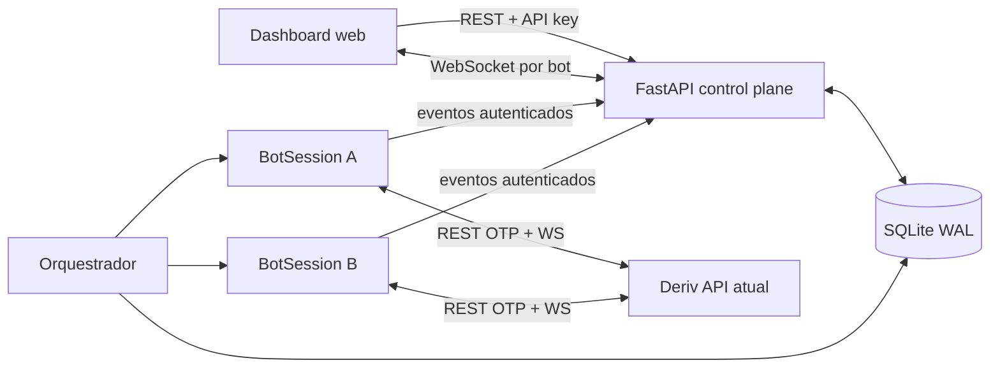

# Arquitetura

## Objetivos

O NexusTrader separa o plano de controle web do plano de execução dos robôs. Configurações e estados desejados são persistentes; telemetria de alta frequência é mantida em memória com limites explícitos. Cada robô possui seu próprio estado mutável, conexão Deriv, estratégia, risco e gestão de stake.

## Componentes

### Plano de controle

- `api/app.py`: ciclo de vida FastAPI, health check, rotas e WebSocket.
- `api/routes/bots.py`: CRUD, start/stop, trades e snapshot por robô.
- `api/live_store.py`: read model limitado para histórico, último tick, posição e trades recentes.
- `api/websocket_manager.py`: conexões agrupadas por `bot_id`; um cliente não recebe eventos de outro robô.

### Plano de execução

- `core/orchestrator.py`: reconcilia `desired_state` do banco e mantém exatamente uma sessão por robô.
- `core/bot_session.py`: ciclo completo de análise, risco, proposal, buy, monitoramento e liquidação.
- `core/connection.py`: socket vinculado à conta, correlação por `req_id`, heartbeat, reconexão e replay de assinaturas.
- `core/event_publisher.py`: fila limitada e cliente HTTP persistente para telemetria.

### Mercado e negociação

- `data/market_data.py`: carrega `ticks_history`, assina ticks e normaliza histórico/live.
- `data/candles.py`: agrega ticks em OHLC sem reescrever candles fechados por ticks atrasados.
- `strategies/bollinger.py`: estratégia de validação baseada em reversão às Bandas de Bollinger.
- `risk/`: meta, stop, número/stake máximos e circuit breaker.
- `trading/`: proposal, compra demo-only e acompanhamento de `proposal_open_contract`.

## Estados

`desired_state` representa a intenção do operador (`RUNNING` ou `STOPPED`). `runtime_state` representa o processo real (`STARTING`, `RUNNING`, `STOPPING`, `STOPPED`, `ERROR`). Ao parar, novas compras são bloqueadas imediatamente; contratos ativos continuam monitorados até o encerramento.

## Persistência e idempotência

SQLite opera em WAL e `busy_timeout`. `bot_instances` mantém configuração JSON e uma revisão incremental. Trades são únicos por `(bot_id, contract_id)`, permitindo que atualizações abertas/fechadas sejam aplicadas novamente sem duplicar o journal.

O `LiveStore` é descartável: depois de reiniciar a API, o histórico persistente continua no banco e o mercado é repovoado quando cada sessão publica novo histórico.

## Escala futura

As interfaces entre orquestrador, repositório e publisher permitem migrar SQLite para PostgreSQL e HTTP interno para Redis Streams/NATS sem alterar estratégias. Para escala horizontal, o próximo passo é leasing distribuído por `bot_id`, evitando dois workers executarem a mesma instância.
