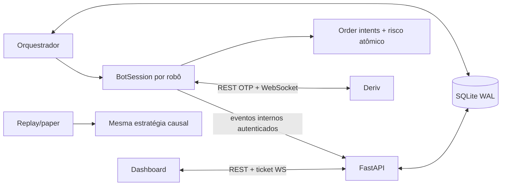

# Estado atual do NexusTrader

Última atualização: **2026-08-07**. Este é o documento canônico do estado técnico.

## Perfil operacional fixo

| Item | Valor |
|---|---|
| Estratégia | Donchian + ZigZag causal |
| Donchian | período 21, vela atual incluída |
| ZigZag | deviation 1%, depth 15, backstep 3 |
| Sinal PUT | ponta HIGH atual toca Donchian superior |
| Sinal CALL | ponta LOW atual toca Donchian inferior |
| Timeframe | 60 segundos |
| Expiração | 2 minutos |
| Ambiente local | DEMO obrigatório |

A ponta flutuante deve pertencer à vela viva. Um extremo histórico não gera ordem
tardia e o mesmo extremo/vela não é emitido duas vezes. A decisão usa somente o prefixo
de dados disponível; a última perna pode repintar visualmente, mas dados futuros nunca
são usados para autorizar uma ordem passada.

## Estado implementado

- A resposta perdida de `buy` é coberta por `order_intents` persistidos antes do envio,
  transaction stream, `portfolio` e `statement`. Não existe retry cego; resultado
  desconhecido coloca a conta em quarentena.
- Intents já vinculados, mas ainda não transformados em trade por causa de crash, são
  recuperados no próximo start.
- Fechamento de trade e avanço de Martingale/Soros/circuit breaker são atômicos e
  idempotentes; stake, níveis, sequências e cooldown sobrevivem a restart.
- Contratos expirados só fecham quando a Deriv informa `is_sold=1`; enquanto isso a UI
  mostra **AGUARDANDO LIQUIDAÇÃO**.
- O orquestrador normaliza estados ativos antigos quando a intenção é STOPPED e não há
  sessão local.
- `/health/live` mede o processo. `/health/ready` mede banco e, para bots desejados como
  RUNNING, orquestrador, heartbeat, Deriv, publisher, mercado e ownership.
- REAL exige flag, teto de stake, revalidação da conta e ticket curto de uso único após
  digitar `REAL <account_id>`. A revisão do bot invalida o ticket.
- `POST /bots/stop-all` persiste a parada global e revoga confirmações REAL.
- Replay/paper determinístico aceita JSONL de ticks, não fabrica settlement ausente e
  produz hash, P&L, expectancy, profit factor, payoff, drawdown, streak, exposição,
  payout e curva de equity.
- Containers rodam sem root, com filesystem somente leitura, capabilities removidas,
  limites de CPU/memória/PIDs, rotação de logs, healthcheck e volume SQLite.
- O ingress público exclui `/api/v1/internal`; os dois segredos usam comparação
  constante e a resposta HTTP recebe CSP e headers de segurança.

## Fronteiras da validação

Código pode ser validado quanto a correção e recuperação, não quanto a lucro garantido.
Uma avaliação de performance exige um dataset representativo/out-of-sample fornecido
ao replay e uma campanha DEMO prolongada. Nenhuma ordem REAL deve ser usada como smoke
test. A implantação da VPS continua sendo uma ação operacional separada: faça backup,
smoke DEMO e siga `OPERATIONS.md`.

O token Telegram anteriormente exposto deve ser rotacionado no BotFather; a credencial
não é reproduzida aqui e essa ação externa foi explicitamente excluída desta fase.

## Arquitetura resumida



## Baseline de entrega

Execute antes de cada deploy:

```powershell
.\.venv\Scripts\python.exe -m unittest discover -s tests -v
.\.venv\Scripts\python.exe -m compileall -q api backtest core data database risk strategies trading
node --test tests/js/*.test.mjs
.\.venv\Scripts\python.exe -m pip check
docker compose config --quiet
```

O relatório de evidência desta fase fica em `docs/VALIDATION-2026-08-07.md`.
