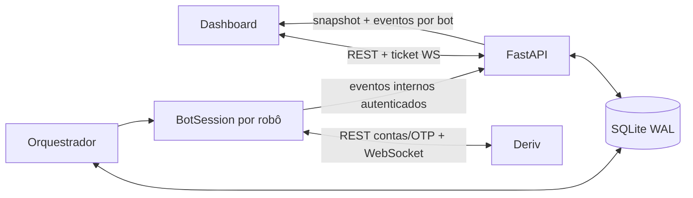

# Estado atual do NexusTrader

Última atualização: **2026-08-06**. Este é o ponto de entrada canônico para agentes e
desenvolvedores. Para evidências e detalhes das correções, consulte
[`AUDIT-2026-08-06.md`](AUDIT-2026-08-06.md).

## Resumo em 60 segundos

O NexusTrader é uma plataforma FastAPI/Python com dashboard web para administrar vários
robôs isolados. A arquitetura continua multi-robô, mas **somente a estratégia
Donchian+ZigZag está habilitada neste momento**. API e orquestrador são processos
separados, compartilham SQLite e sincronizam telemetria por eventos internos; o browser
recebe snapshot e atualizações por WebSocket.

O perfil operacional vigente é fixo no backend:

| Item | Valor vigente |
|---|---|
| Estratégia | `donchian` / Donchian+ZigZag |
| Ativo | `R_75` |
| Gráfico/análise | candles de 60 segundos (1 minuto) |
| Expiração | `duration=2`, `duration_unit=m` |
| Donchian | período 21 |
| ZigZag | depth 15, deviation 0, backstep 3 |
| Ambiente de validação | conta Deriv DEMO |

## Estado por ambiente

| Ambiente | Estado conhecido em 2026-08-06 |
|---|---|
| Repositório | correções de estabilidade/segurança e auditoria registradas no branch `main` |
| Localhost | stack validada em DEMO; após reconciliação pontual pós-rollout, 7 trades fechados, 0 abertos e `desired_state=STOPPED` |
| Produção | inspeção somente leitura em `https://trade.solucoes-nexus.tech/`; nenhum deploy foi executado nesta sessão |

Não presuma que a VPS contém os commits auditados apenas porque eles estão no
repositório. Antes de qualquer atualização, compare o commit implantado, faça backup e
siga `docs/OPERATIONS.md`. Deploy continua exigindo autorização explícita.

## Regras que não podem ser inferidas nem “melhoradas”

1. Não mude o conceito, timing, filtros ou parâmetros da estratégia sem autorização
   explícita do proprietário.
2. Não substitua o ZigZag causal do projeto pelo ZigZag oficial do TradingView. Eles não
   têm semântica idêntica; a diferença é conhecida e intencionalmente preservada.
3. Não reintroduza Bollinger, `R_100`, gráfico de 5 minutos ou expiração de 5 ticks como
   defaults. Referências assim em planos/auditorias antigos são históricas.
4. Preserve o desenho multi-robô. “Uma estratégia habilitada” não significa “um único
   robô possível”.
5. Não use conta REAL em testes. A aplicação possui liberação explícita para produção,
   mas ela não faz parte da validação local nem autoriza ordens reais.

## Fluxo atual



- `api/app.py` inicia API, autenticação, tickets WebSocket e ciclo do read model.
- `core/orchestrator.py` reconcilia `desired_state` persistido com as sessões reais.
- `core/bot_session.py` conecta mercado, monta a estratégia, executa risco/compra e
  acompanha contratos.
- `data/market_data.py` e `data/candles.py` mantêm histórico, ticks e OHLC.
- `api/live_store.py` mantém o snapshot descartável do dashboard.
- `database/repository.py` persiste bots, sessões e journal idempotente de trades.

## Estabilidade já implementada e validada

- contratos abertos pertencentes ao bot são resubscritos depois de restart, mesmo que
  tenham desaparecido de `portfolio`; após a expiração, a assinatura é respaldada por
  consultas `proposal_open_contract` até a Deriv informar `is_sold=1`, único gate de
  encerramento;
- settlement só é marcado como processado depois da persistência;
- eventos críticos têm retry e o histórico completo é republicado periodicamente;
- o candle ao vivo continua a última vela histórica em vez de criar um estado solto;
- o `LiveStore` recompõe mercado e indicadores após restart da API;
- timestamps repetidos do ZigZag são saneados somente na renderização;
- troca de bot, séries antigas e clientes WebSocket lentos são isolados;
- totais diários usam `America/Sao_Paulo`;
- parada e espera de settlement são limitadas e recuperáveis;
- a chave do dashboard não entra mais na URL: o frontend obtém ticket WebSocket de uso
  único.

Durante esse intervalo pós-expiração, snapshots e eventos mantêm o trade aberto com
`lifecycle_state="awaiting_settlement"`. O dashboard mostra **AGUARDANDO LIQUIDAÇÃO** e
trata o P&L como provisório; ele só contabiliza o resultado e remove o card ativo após
o evento terminal `trade.closed`.

Na verificação pós-rollout de 2026-08-06, o contrato DEMO `8284624279` já constava como
`closed/lost`, lucro `-50.00`, antes do restart controlado; portanto, o primeiro
fechamento não foi atribuído ao restart. Um harness sem `BotSession`, trade loop ou
`OrderExecutor` executou uma única consulta autenticada e allowlisted por contrato com
o novo `ContractMonitor`: a Deriv confirmou `is_sold=1` e o upsert idempotente manteve
7 trades e uma ocorrência. A mesma validação encontrou a linha local-owned
`8288215859` ainda aberta, recebeu `is_sold=1/lost/-50.00` e a fechou pelo mesmo
repository, também sem criar linha. Ao final havia 7 trades fechados e nenhum aberto;
API e painel mostravam `active_trade=null`/sem posição, bot inicialmente `STOP` e zero
novas ordens nos logs pós-rollout. O `runtime_state=STOPPING` remanescente era
telemetria persistida
do processo anterior; depois de confirmar 0 trades abertos, PIDs antigos encerrados e
ausência de sessão nova, a limpeza controlada usou
`DatabaseRepository.set_runtime_state` para normalizá-lo a `STOPPED`. Essa normalização
foi operacional e explícita, não comportamento automático do orquestrador; após reload,
o painel mostrou o bot `OFF`.

Em localhost/DEMO foram observados 500 candles iniciais, ticks ao vivo, indicadores,
zero erros de console e dois contratos de 120 segundos fechados corretamente. O segundo
cenário incluiu restart controlado e recuperação de settlement. A evidência completa
está na auditoria vigente. A baseline automatizada dessa validação foi de 76 testes
Python e 5 testes JavaScript, além de `compileall` e `pip check` sem falhas.

## Riscos e pendências conhecidas

1. Uma compra aceita pela Deriv cuja resposta se perca ainda pode ficar sem ownership
   local; a solução correta exige reconciliação por transações, nunca retry cego de
   `buy`.
2. Parte do estado de Martingale/Soros e circuit breaker ainda é somente em memória.
3. `/health` comprova API e SQLite, não a saúde completa da conexão Deriv/publisher/bot.
4. O endpoint interno divide o serviço da API pública, embora seja autenticado.
5. O container ainda roda como root e faltam limites de recurso e rotação de logs.
6. O token Telegram encontrado no histórico Git deve ser rotacionado no BotFather. Não
   reproduza a credencial em issue, log ou documentação.
7. Há warnings de depreciação do `TestClient`/HTTPX e dependências a revisar; eles não
   causaram falha funcional na validação de 2026-08-06.
8. Um orquestrador reiniciado com `desired_state=STOPPED` não normaliza sozinho um
   `runtime_state` antigo quando não existe sessão viva; consumidores devem distinguir
   intenção persistida de telemetria do último processo.

## Desenvolvimento local seguro

Requisitos: Python 3.11+, `.venv`, dependências de `requirements.txt` e `.env` com conta
Deriv DEMO. No Windows:

```powershell
powershell -ExecutionPolicy Bypass -File scripts/start_dev.ps1
```

O launcher inicia API e orquestrador em `http://127.0.0.1:8990`, força
`ALLOW_REAL_TRADING=false`, usa `DEV_MODE=true` e isola os dados em
`storage/nexus_trader.dev.db`. Ele não seleciona conta nem inicia robô automaticamente.

Validação mínima antes de alterar produção:

```powershell
.\.venv\Scripts\python.exe -m unittest discover -s tests -v
.\.venv\Scripts\python.exe -m compileall -q api core data database risk strategies trading
node --test tests/js/*.test.mjs
.\.venv\Scripts\python.exe -m pip check
```

No browser, confirme conta DEMO, Donchian+ZigZag, R_75, 1m/2m, carga histórica, ticks,
WebSocket, abertura/atualização/fechamento e console sem erros. Pare o bot e aguarde
`desired_state=STOPPED` e `runtime_state=STOPPED`.

## Mapa de leitura

| Necessidade | Documento/arquivo |
|---|---|
| Estado vigente e restrições | este documento e `AGENTS.md` |
| Evidências, correções e riscos | `docs/AUDIT-2026-08-06.md` |
| Componentes e fluxo | `docs/ARCHITECTURE.md` |
| Contratos REST/WebSocket | `docs/API.md` |
| Integração Deriv | `docs/DERIV-API-REFERENCE.md` |
| Ambiente local e testes | `docs/DEVELOPMENT.md` |
| VPS, deploy e incidentes | `docs/OPERATIONS.md` |
| Segredos e ameaças | `docs/SECURITY.md` |
| Regras da estratégia | `strategies/donchian_zigzag.py` e `utils/indicators.py` |

Em caso de divergência, o código e os testes vigentes prevalecem; atualize este arquivo
na mesma mudança. Documentos em `docs/plans/`, `docs/superpowers/` e auditorias de datas
anteriores registram decisões passadas e não devem ser usados como defaults atuais.
