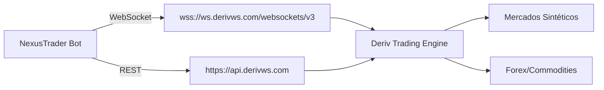
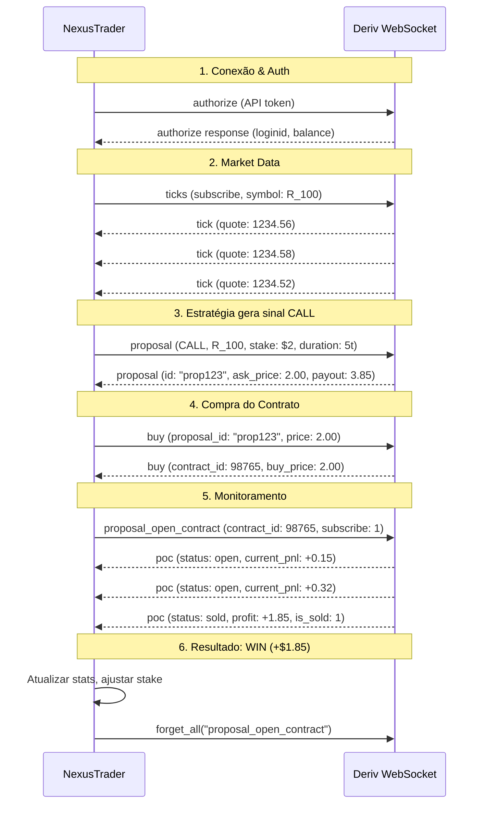
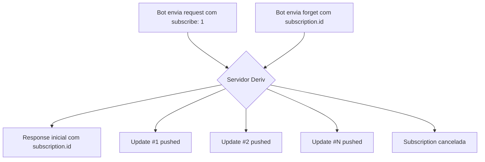

# 📚 Deriv API - Referência Técnica Completa

> **Documento de referência técnica** para integração com a Deriv API.
> Base de conhecimento para o projeto **NexusTrader**.

---

## 📋 Índice

1. [Visão Geral da Arquitetura](#1-visão-geral-da-arquitetura)
2. [Conexão WebSocket](#2-conexão-websocket)
3. [Autenticação](#3-autenticação)
4. [Catálogo Completo de API Calls](#4-catálogo-completo-de-api-calls)
5. [Dados de Mercado](#5-dados-de-mercado)
6. [Trading - Ciclo de Vida do Contrato](#6-trading---ciclo-de-vida-do-contrato)
7. [Tipos de Contrato Suportados](#7-tipos-de-contrato-suportados)
8. [Mercados e Símbolos Disponíveis](#8-mercados-e-símbolos-disponíveis)
9. [Modelo de Subscriptions](#9-modelo-de-subscriptions)
10. [Rate Limits e Restrições](#10-rate-limits-e-restrições)
11. [Tratamento de Erros](#11-tratamento-de-erros)
12. [Python SDK (python-deriv-api)](#12-python-sdk-python-deriv-api)
13. [REST API Endpoints](#13-rest-api-endpoints)
14. [Segurança e Boas Práticas](#14-segurança-e-boas-práticas)

---

## 1. Visão Geral da Arquitetura

A Deriv API utiliza uma **arquitetura híbrida**:

| Componente | Protocolo | Uso Principal |
|:-----------|:----------|:--------------|
| **WebSocket API** | `wss://` | Trading em tempo real, market data, subscriptions |
| **REST API** | `https://` | Gerenciamento de contas, OTP, setup inicial |



### Princípios Fundamentais

- **Todas as mensagens são JSON** (request e response)
- **Comunicação assíncrona**: Cada request pode incluir um `req_id` para rastreamento
- **Push model**: Subscriptions enviam atualizações automaticamente sem polling
- **Campo `passthrough`**: Objeto arbitrário que o servidor devolve na resposta (útil para contexto)

---

## 2. Conexão WebSocket

### Endpoint

```
wss://ws.derivws.com/websockets/v3?app_id={SEU_APP_ID}
```

> **Endpoint legado (ainda funcional):** `wss://ws.binaryws.com/websockets/v3?app_id={SEU_APP_ID}`

### Parâmetros de Conexão

| Parâmetro | Tipo | Obrigatório | Descrição |
|:----------|:-----|:------------|:----------|
| `app_id` | integer | ✅ | ID da aplicação registrada no portal do desenvolvedor |
| `l` | string | ❌ | Idioma (ex: `PT` para português) |
| `brand` | string | ❌ | Marca (default: `deriv`) |

### Como Obter um App ID

1. Acesse [https://developers.deriv.com](https://developers.deriv.com)
2. Faça login com sua conta Deriv
3. Vá em **Registered Apps** → **Register New App**
4. Escolha **Native App** (para bots backend) ou **Web-based App**
5. Selecione os escopos: **Trade**, **Account Management**
6. O App ID será gerado automaticamente

### Timeout e Keepalive

- **Timeout de inatividade**: 2 minutos sem mensagens → conexão é encerrada pelo servidor
- **Solução**: Enviar `ping` a cada 30 segundos

```json
// Request
{"ping": 1}

// Response
{"ping": "pong", "echo_req": {"ping": 1}}
```

---

## 3. Autenticação

### 3.1 Via API Token (PAT - Personal Access Token)

**Método recomendado para bots.**

```json
// Request
{
    "authorize": "SEU_API_TOKEN_AQUI"
}

// Response (sucesso)
{
    "authorize": {
        "account_list": [
            {
                "account_category": "trading",
                "account_type": "standard",
                "currency": "USD",
                "is_disabled": 0,
                "is_virtual": 1,
                "landing_company_name": "virtual",
                "loginid": "VRTC1234567"
            }
        ],
        "balance": 10000.00,
        "country": "br",
        "currency": "USD",
        "email": "user@example.com",
        "fullname": "Nome Completo",
        "is_virtual": 1,
        "landing_company_fullname": "Deriv (SVG) LLC",
        "landing_company_name": "svg",
        "local_currencies": {},
        "loginid": "VRTC1234567",
        "preferred_language": "PT",
        "scopes": ["read", "trade", "admin"],
        "upgradeable_landing_companies": [],
        "user_id": 12345678
    },
    "echo_req": {"authorize": "SEU_API_TOKEN_AQUI"},
    "msg_type": "authorize",
    "req_id": 1
}
```

### 3.2 Escopos do Token

| Escopo | Permissões | Necessário para NexusTrader? |
|:-------|:-----------|:----------------------------|
| **Read** | Consultar saldo, portfólio, histórico | ✅ Sim |
| **Trade** | Comprar e vender contratos | ✅ Sim |
| **Payments** | Depósitos e saques | ❌ Não |
| **Admin** | Alterar configurações da conta | ❌ Não |

> ⚠️ **IMPORTANTE**: Use o princípio do menor privilégio. Para o NexusTrader, ative **apenas** `Read` e `Trade`.

### 3.3 Via OAuth 2.0

Usado para aplicações web que redirecionam usuários para login na Deriv.
**Não é necessário para bots em VPS** — usamos PAT.

### 3.4 Via OTP (One-Time Password)

Fluxo mais recente da Deriv para a nova REST API:
1. `POST /trading/v1/options/accounts/{accountId}/otp` → Retorna OTP + WebSocket URL pré-autenticado
2. Conectar na URL retornada (válida por 120 segundos)

---

## 4. Catálogo Completo de API Calls

### 4.1 Sistema & Conexão

| Call | Descrição | Requer Auth? |
|:-----|:----------|:-------------|
| `ping` | Teste de conexão / keepalive | ❌ |
| `time` | Hora atual do servidor (epoch) | ❌ |
| `website_status` | Status do site + rate limits | ❌ |
| `server_status` | Status do servidor + `api_call_limits` | ❌ |

### 4.2 Autenticação

| Call | Descrição | Requer Auth? |
|:-----|:----------|:-------------|
| `authorize` | Autenticar com token API | ❌ |
| `logout` | Encerrar sessão | ✅ |

### 4.3 Dados de Mercado

| Call | Descrição | Subscriptions? | Requer Auth? |
|:-----|:----------|:--------------|:-------------|
| `active_symbols` | Lista de ativos disponíveis | ❌ | ❌ |
| `contracts_for` | Contratos disponíveis para um ativo | ❌ | ❌ |
| `ticks` | Stream de preços em tempo real | ✅ | ❌ |
| `ticks_history` | Histórico de ticks ou candles OHLC | ✅ (opcional) | ❌ |
| `trading_times` | Horários de operação | ❌ | ❌ |
| `asset_index` | Índice de ativos com detalhes | ❌ | ❌ |

### 4.4 Trading

| Call | Descrição | Subscriptions? | Requer Auth? |
|:-----|:----------|:--------------|:-------------|
| `proposal` | Cotação de contrato (preço, payout) | ✅ | ❌ |
| `buy` | Comprar contrato | ❌ | ✅ |
| `sell` | Vender contrato antecipadamente | ❌ | ✅ |
| `cancel` | Cancelar contrato (se permitido) | ❌ | ✅ |
| `contract_update` | Atualizar stop loss/take profit | ❌ | ✅ |

### 4.5 Conta & Portfólio

| Call | Descrição | Subscriptions? | Requer Auth? |
|:-----|:----------|:--------------|:-------------|
| `balance` | Saldo da conta | ✅ | ✅ |
| `portfolio` | Contratos abertos | ❌ | ✅ |
| `profit_table` | Histórico de lucros/prejuízos | ❌ | ✅ |
| `statement` | Extrato da conta | ❌ | ✅ |
| `transaction` | Stream de transações | ✅ | ✅ |
| `get_account_status` | Status da conta | ❌ | ✅ |
| `get_settings` | Configurações do usuário | ❌ | ✅ |
| `proposal_open_contract` | Monitorar contrato aberto | ✅ | ✅ |

### 4.6 Gerenciamento de Subscriptions

| Call | Descrição | Requer Auth? |
|:-----|:----------|:-------------|
| `forget` | Cancelar uma subscription específica | ❌ |
| `forget_all` | Cancelar todas subscriptions de um tipo | ❌ |

---

## 5. Dados de Mercado

### 5.1 Ticks (Preços em Tempo Real)

```json
// Request - Subscribe to ticks
{
    "ticks": "R_100",
    "subscribe": 1,
    "req_id": 100
}

// Response - Initial + Ongoing updates
{
    "tick": {
        "ask": 1234.56,
        "bid": 1234.45,
        "epoch": 1691234567,
        "id": "abc123-subscription-id",
        "pip_size": 2,
        "quote": 1234.505,
        "symbol": "R_100"
    },
    "echo_req": {"ticks": "R_100", "subscribe": 1},
    "msg_type": "tick",
    "subscription": {"id": "abc123-subscription-id"}
}
```

### 5.2 Histórico de Ticks

```json
// Request
{
    "ticks_history": "R_100",
    "adjust_start_time": 1,
    "count": 500,
    "end": "latest",
    "start": 1,
    "style": "ticks",
    "req_id": 101
}

// Response
{
    "history": {
        "prices": [1234.12, 1234.15, 1234.10, ...],
        "times": [1691234560, 1691234561, 1691234562, ...]
    },
    "echo_req": {...},
    "msg_type": "history"
}
```

### 5.3 Candles (OHLC)

```json
// Request
{
    "ticks_history": "R_100",
    "adjust_start_time": 1,
    "count": 100,
    "end": "latest",
    "start": 1,
    "style": "candles",
    "granularity": 60,
    "req_id": 102
}

// Response
{
    "candles": [
        {
            "close": 1234.56,
            "epoch": 1691234560,
            "high": 1235.00,
            "low": 1234.00,
            "open": 1234.20
        }
    ],
    "msg_type": "candles"
}
```

**Granularidades suportadas**: `60` (1min), `120` (2min), `180` (3min), `300` (5min), `600` (10min), `900` (15min), `1800` (30min), `3600` (1h), `7200` (2h), `14400` (4h), `28800` (8h), `86400` (1 dia)

---

## 6. Trading - Ciclo de Vida do Contrato



### 6.1 Proposal (Cotação)

```json
// Request
{
    "proposal": 1,
    "amount": 2.00,
    "basis": "stake",
    "contract_type": "CALL",
    "currency": "USD",
    "duration": 5,
    "duration_unit": "t",
    "symbol": "R_100",
    "subscribe": 1,
    "req_id": 200
}

// Response
{
    "proposal": {
        "ask_price": 2.00,
        "date_expiry": 1691234600,
        "date_start": 1691234567,
        "display_value": "2.00",
        "id": "proposal-uuid-123",
        "longcode": "Win payout if Volatility 100 Index is strictly higher than entry spot at 5 ticks after contract start time.",
        "payout": 3.85,
        "spot": 1234.56,
        "spot_time": 1691234567
    },
    "msg_type": "proposal",
    "subscription": {"id": "sub-uuid-456"}
}
```

**Campos `basis`**:
- `"stake"` → Você define quanto quer apostar; o sistema calcula o payout
- `"payout"` → Você define quanto quer receber; o sistema calcula o custo

**Campos `duration_unit`**:
- `"t"` → Ticks
- `"s"` → Segundos
- `"m"` → Minutos
- `"h"` → Horas
- `"d"` → Dias

### 6.2 Buy (Compra)

```json
// Request
{
    "buy": "proposal-uuid-123",
    "price": 2.00,
    "req_id": 201
}

// Response
{
    "buy": {
        "balance_after": 9998.00,
        "buy_price": 2.00,
        "contract_id": 98765432,
        "longcode": "Win payout if ...",
        "payout": 3.85,
        "purchase_time": 1691234567,
        "shortcode": "CALL_R_100_2.00_1691234567_5T_S0P_0",
        "start_time": 1691234567,
        "transaction_id": 11223344
    },
    "msg_type": "buy"
}
```

### 6.3 Proposal Open Contract (Monitoramento)

```json
// Request
{
    "proposal_open_contract": 1,
    "contract_id": 98765432,
    "subscribe": 1,
    "req_id": 202
}

// Response (enquanto aberto)
{
    "proposal_open_contract": {
        "contract_id": 98765432,
        "contract_type": "CALL",
        "currency": "USD",
        "buy_price": 2.00,
        "current_spot": 1234.78,
        "current_spot_time": 1691234570,
        "entry_spot": 1234.56,
        "is_expired": 0,
        "is_forward_starting": 0,
        "is_intraday": 1,
        "is_path_dependent": 0,
        "is_settleable": 0,
        "is_sold": 0,
        "is_valid_to_cancel": 0,
        "is_valid_to_sell": 0,
        "payout": 3.85,
        "profit": 1.85,
        "profit_percentage": 92.5,
        "status": "open"
    },
    "msg_type": "proposal_open_contract",
    "subscription": {"id": "sub-uuid-789"}
}

// Response (quando liquidado)
{
    "proposal_open_contract": {
        "contract_id": 98765432,
        "exit_tick": 1234.78,
        "exit_tick_time": 1691234572,
        "is_expired": 1,
        "is_sold": 1,
        "profit": 1.85,
        "sell_price": 3.85,
        "sell_time": 1691234572,
        "status": "won"
    }
}
```

### 6.4 Sell (Venda Antecipada)

```json
// Request
{
    "sell": 98765432,
    "price": 0,
    "req_id": 203
}

// Response
{
    "sell": {
        "balance_after": 10001.50,
        "contract_id": 98765432,
        "reference_id": 55667788,
        "sell_price": 3.50,
        "transaction_id": 11223355
    }
}
```

---

## 7. Tipos de Contrato Suportados

### 7.1 Rise/Fall (Call/Put) — Mais Usado

| Tipo | Contract Type | Descrição |
|:-----|:-------------|:----------|
| Rise (Compra) | `CALL` | Preço final > preço de entrada |
| Fall (Venda) | `PUT` | Preço final < preço de entrada |
| Higher | `CALL` | Preço final > barreira |
| Lower | `PUT` | Preço final < barreira |

### 7.2 Digits

| Tipo | Contract Type | Descrição |
|:-----|:-------------|:----------|
| Matches | `DIGITMATCH` | Último dígito = valor escolhido |
| Differs | `DIGITDIFF` | Último dígito ≠ valor escolhido |
| Over | `DIGITOVER` | Último dígito > valor escolhido |
| Under | `DIGITUNDER` | Último dígito < valor escolhido |
| Even | `DIGITEVEN` | Último dígito é par |
| Odd | `DIGITODD` | Último dígito é ímpar |

### 7.3 Touch/No Touch

| Tipo | Contract Type | Descrição |
|:-----|:-------------|:----------|
| Touch | `ONETOUCH` | Preço toca a barreira pelo menos 1x |
| No Touch | `NOTOUCH` | Preço nunca toca a barreira |

### 7.4 In/Out (Boundary)

| Tipo | Contract Type | Descrição |
|:-----|:-------------|:----------|
| Ends Between | `RANGE` | Preço final dentro das barreiras |
| Ends Outside | `UPORDOWN` | Preço final fora das barreiras |
| Stays Between | `EXPIRYRANGE` | Preço permanece dentro durante toda a duração |
| Goes Outside | `EXPIRYMISS` | Preço sai das barreiras em algum momento |

### 7.5 Multipliers & Accumulators

| Tipo | Contract Type | Descrição |
|:-----|:-------------|:----------|
| Multiplier Up | `MULTUP` | Multiplicador de alta |
| Multiplier Down | `MULTDOWN` | Multiplicador de baixa |
| Accumulator | `ACCU` | Acumulador progressivo |

> 💡 **Dica**: Use `contracts_for` com o símbolo desejado para obter a lista dinâmica de contratos disponíveis. Nem todos os tipos estão disponíveis para todos os ativos.

---

## 8. Mercados e Símbolos Disponíveis

### 8.1 Índices Sintéticos (Volatility Indices)

| Símbolo | Nome | Disponibilidade |
|:--------|:-----|:----------------|
| `R_10` | Volatility 10 Index | 24/7 |
| `R_25` | Volatility 25 Index | 24/7 |
| `R_50` | Volatility 50 Index | 24/7 |
| `R_75` | Volatility 75 Index | 24/7 |
| `R_100` | Volatility 100 Index | 24/7 |
| `1HZ10V` | Volatility 10 (1s) Index | 24/7 |
| `1HZ25V` | Volatility 25 (1s) Index | 24/7 |
| `1HZ50V` | Volatility 50 (1s) Index | 24/7 |
| `1HZ75V` | Volatility 75 (1s) Index | 24/7 |
| `1HZ100V` | Volatility 100 (1s) Index | 24/7 |

### 8.2 Crash & Boom

| Símbolo | Nome |
|:--------|:-----|
| `BOOM500` | Boom 500 Index |
| `BOOM1000` | Boom 1000 Index |
| `CRASH500` | Crash 500 Index |
| `CRASH1000` | Crash 1000 Index |

### 8.3 Step & Range Break & Jump

| Símbolo | Nome |
|:--------|:-----|
| `stpRNG` | Step Index |
| `RDBULL` | Range Break 100 |
| `RDBEAR` | Range Break 200 |
| `JD10` | Jump 10 Index |
| `JD25` | Jump 25 Index |
| `JD50` | Jump 50 Index |
| `JD75` | Jump 75 Index |
| `JD100` | Jump 100 Index |

### 8.4 Forex (Exemplos)

| Símbolo | Nome |
|:--------|:-----|
| `frxEURUSD` | EUR/USD |
| `frxGBPUSD` | GBP/USD |
| `frxUSDJPY` | USD/JPY |
| `frxAUDUSD` | AUD/USD |

> ⚠️ **IMPORTANTE**: Sempre use `active_symbols` para obter a lista atualizada. Os símbolos podem mudar conforme a jurisdição e tipo de conta.

---

## 9. Modelo de Subscriptions



### Regras Importantes

1. **Cada subscription retorna um `subscription.id`** — guarde-o para cancelar depois
2. **`forget`** cancela UMA subscription específica:
   ```json
   {"forget": "subscription-id-aqui"}
   ```
3. **`forget_all`** cancela TODAS subscriptions de um tipo:
   ```json
   {"forget_all": "ticks"}
   {"forget_all": "proposal"}
   {"forget_all": "proposal_open_contract"}
   {"forget_all": "balance"}
   {"forget_all": "transaction"}
   ```
4. **Memory leak**: Se você não cancelar subscriptions, o servidor continua enviando dados e pode causar overhead
5. **Após reconexão**: Todas as subscriptions anteriores são perdidas. Você deve re-subscribar manualmente

---

## 10. Rate Limits e Restrições

### Consultando Limites Atuais

```json
// Request
{"website_status": 1}

// Response (trecho relevante)
{
    "website_status": {
        "api_call_limits": {
            "max_proposal_subscription": {
                "applies_to": "proposal_subscription",
                "max": 5
            },
            "max_requestes_general": {
                "applies_to": "rest",
                "hourly": 14400,
                "minutely": 240
            },
            "max_requests_outcome": {
                "applies_to": "outcome",
                "hourly": 3600,
                "minutely": 60
            },
            "max_requests_pricing": {
                "applies_to": "pricing",
                "hourly": 14400,
                "minutely": 240
            }
        }
    }
}
```

### Limites Conhecidos

| Tipo | Limite Aproximado |
|:-----|:-----------------|
| Requests gerais | ~240/min, ~14.400/hora |
| Requests de pricing (proposal) | ~240/min, ~14.400/hora |
| Requests de outcome (buy/sell) | ~60/min, ~3.600/hora |
| Proposal subscriptions simultâneas | ~5 |
| Timeout de inatividade | 120 segundos |

### Boas Práticas

- ✅ Use subscriptions ao invés de polling
- ✅ Cancele subscriptions que não precisa mais (`forget` / `forget_all`)
- ✅ Envie `ping` a cada 30s para keepalive
- ✅ Implemente exponential backoff ao receber `RateLimit`
- ❌ Não abra múltiplas conexões simultâneas desnecessariamente
- ❌ Não faça polling rápido em endpoints que suportam subscription

---

## 11. Tratamento de Erros

### Formato de Erro

```json
{
    "error": {
        "code": "InvalidToken",
        "message": "The token is invalid."
    },
    "echo_req": { ... },
    "msg_type": "authorize",
    "req_id": 1
}
```

### Catálogo de Erros Comuns

| Código | Categoria | Descrição | Ação Recomendada |
|:-------|:----------|:----------|:-----------------|
| `InvalidToken` | Auth | Token expirado ou inválido | Gerar novo token no dashboard |
| `AuthorizationRequired` | Auth | Endpoint requer autenticação | Enviar `authorize` antes |
| `BadSession` | Auth | Sessão inválida | Re-autorizar com novo token |
| `InputValidationFailed` | Validação | Payload com dados inválidos | Verificar campos obrigatórios |
| `ContractBuyValidationError` | Trading | Parâmetros de compra inválidos | Verificar proposal_id e price |
| `ContractCreationFailure` | Trading | Falha ao criar contrato | Retry com novo proposal |
| `InsufficientBalance` | Trading | Saldo insuficiente | Verificar saldo antes de comprar |
| `OfferingsValidationError` | Trading | Contrato indisponível na jurisdição | Verificar com `contracts_for` |
| `CompanyWideLimitExceeded` | Trading | Limite da empresa atingido | Aguardar ou mudar ativo |
| `RateLimit` | Sistema | Excedeu limite de requisições | Exponential backoff |
| `MarketIsClosed` | Mercado | Mercado fechado | Verificar `trading_times` |
| `DisabledAccount` | Conta | Conta desabilitada | Contatar suporte |

### Padrão de Tratamento Recomendado

```python
async def handle_response(response: dict):
    if 'error' in response:
        error = response['error']
        code = error['code']
        message = error['message']
        
        if code == 'RateLimit':
            await asyncio.sleep(backoff_delay)
            return RetryAction()
        elif code in ('InvalidToken', 'BadSession'):
            await re_authorize()
            return RetryAction()
        elif code == 'ContractBuyValidationError':
            logger.error(f"Buy failed: {message}")
            return SkipAction()
        elif code == 'InsufficientBalance':
            logger.critical("Insufficient balance - stopping bot")
            return StopAction()
        else:
            logger.warning(f"Unhandled error: {code} - {message}")
            return SkipAction()
    
    return ProcessAction(response)
```

---

## 12. Python SDK (python-deriv-api)

### Instalação

```bash
pip install python_deriv_api
```

> **Requisitos**: Python 3.9.6+ (evitar 3.9.7 devido a bug na lib `websockets`)

### Uso Básico

```python
import asyncio
from deriv_api import DerivAPI

async def main():
    # 1. Conectar
    api = DerivAPI(app_id=1089)  # Use seu próprio App ID
    
    # 2. Testar conexão
    ping = await api.ping({'ping': 1})
    print(f"Ping: {ping}")
    
    # 3. Autorizar
    auth = await api.authorize('SEU_TOKEN_AQUI')
    print(f"Logado como: {auth['authorize']['loginid']}")
    print(f"Saldo: {auth['authorize']['balance']}")
    
    # 4. Listar ativos
    symbols = await api.active_symbols({"active_symbols": "brief"})
    
    # 5. Subscribir a ticks
    ticks_sub = await api.subscribe({'ticks': 'R_100', 'subscribe': 1})
    
    # 6. Receber ticks
    async for tick in ticks_sub:
        quote = tick['tick']['quote']
        print(f"Tick: {quote}")
        
        # 7. Criar proposal
        proposal = await api.proposal({
            "proposal": 1,
            "amount": 2.00,
            "basis": "stake",
            "contract_type": "CALL",
            "currency": "USD",
            "duration": 5,
            "duration_unit": "t",
            "symbol": "R_100"
        })
        
        proposal_id = proposal['proposal']['id']
        payout = proposal['proposal']['payout']
        
        # 8. Comprar
        buy = await api.buy({"buy": proposal_id, "price": 2.00})
        contract_id = buy['buy']['contract_id']
        print(f"Contrato comprado: {contract_id}")
        
        break  # Apenas 1 trade para demonstração

asyncio.run(main())
```

### Métodos Disponíveis

O SDK é dinâmico — qualquer chamada da API pode ser feita como método:

```python
# Padrão: await api.<nome_da_call>({...})
await api.ping({'ping': 1})
await api.authorize('TOKEN')
await api.active_symbols({"active_symbols": "brief"})
await api.contracts_for({"contracts_for": "R_100"})
await api.ticks_history({"ticks_history": "R_100", "count": 100, "end": "latest", "style": "ticks"})
await api.proposal({...})
await api.buy({...})
await api.sell({...})
await api.balance({"balance": 1, "subscribe": 1})
await api.portfolio({"portfolio": 1})
await api.profit_table({"profit_table": 1, "limit": 50})
await api.statement({"statement": 1, "limit": 50})
await api.forget({"forget": "subscription_id"})
await api.forget_all({"forget_all": "ticks"})
```

---

## 13. REST API Endpoints

**Base URL**: `https://api.derivws.com`

### Headers Obrigatórios

```
Authorization: Bearer {OAUTH_TOKEN ou PAT}
Deriv-App-ID: {SEU_APP_ID}
Content-Type: application/json
```

### Endpoints Disponíveis

| Método | Endpoint | Descrição |
|:-------|:---------|:----------|
| `GET` | `/trading/v1/options/accounts` | Listar contas de trading |
| `POST` | `/trading/v1/options/accounts` | Criar conta de trading |
| `POST` | `/trading/v1/options/accounts/{id}/reset-demo-balance` | Resetar saldo demo |
| `POST` | `/trading/v1/options/accounts/{id}/otp` | Gerar OTP para WebSocket |

---

## 14. Segurança e Boas Práticas

### ✅ Fazer

1. **Armazenar tokens em `.env`** — Nunca hardcode no código
2. **Adicionar `.env` ao `.gitignore`** — Nunca commitar credenciais
3. **Usar apenas escopos necessários** — `Read` + `Trade` para bots
4. **Implementar circuit breaker** — Parar após N losses seguidos
5. **Definir stop loss máximo** — Nunca operar sem limite de perda
6. **Testar em conta demo primeiro** — Sempre validar antes de usar dinheiro real
7. **Monitorar logs** — Registrar toda operação para auditoria
8. **Implementar reconnection** — Conexões WebSocket podem cair

### ❌ Não Fazer

1. **Não habilitar escopo `Admin` ou `Payments`** em tokens de trading
2. **Não fazer polling** quando subscription está disponível
3. **Não ignorar erros de rate limit** — Sempre implementar backoff
4. **Não rodar múltiplas instâncias** sem controle de concorrência
5. **Não operar sem stop loss** — Risco de perda total
6. **Não commitar `.env`** — Risco de exposição de credenciais

---

> 📝 **Última atualização**: Agosto 2026
> 📖 **Fonte**: [developers.deriv.com](https://developers.deriv.com/docs/) | [API Playground](https://developers.deriv.com/playground/)
