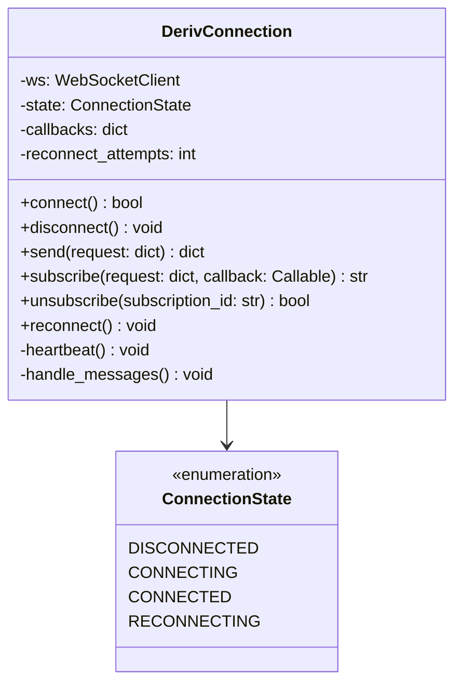
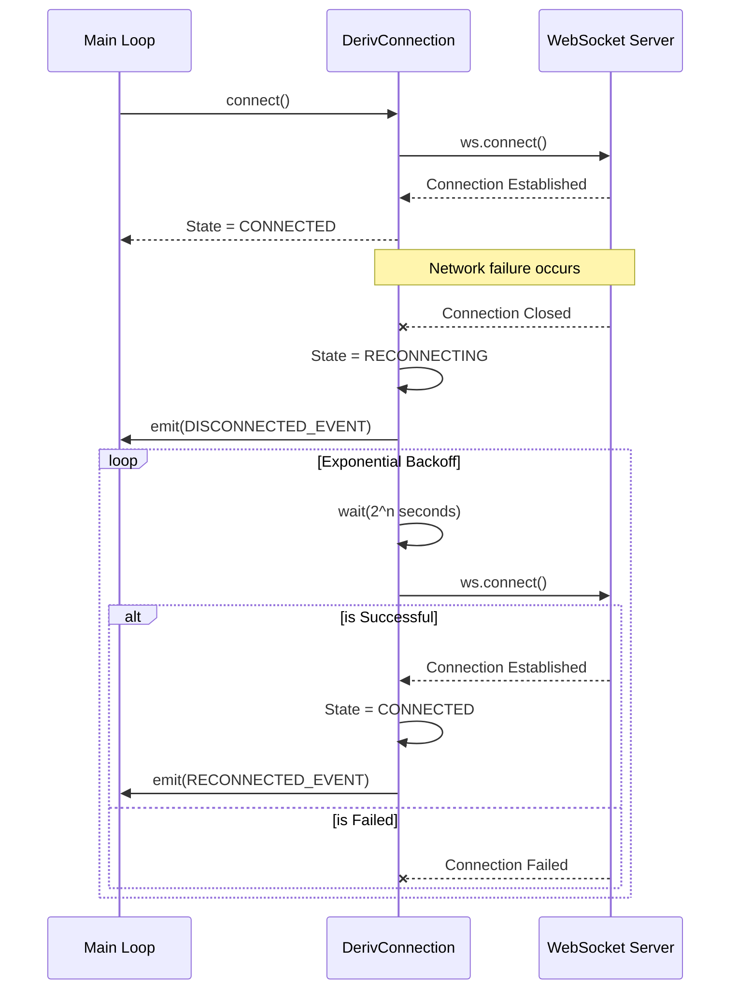
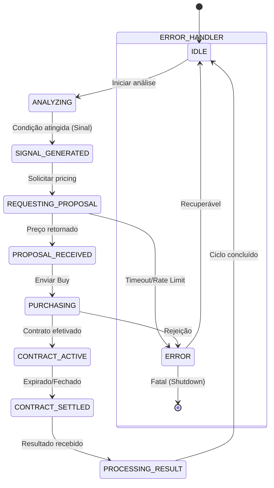
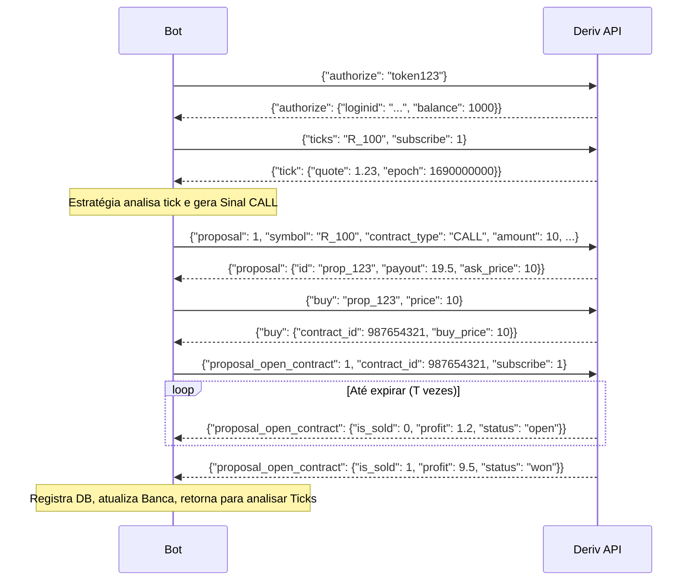

# NexusTrader: Especificação Técnica - Fase 1 (Core Engine & Conexão com a API)

Este documento detalha a arquitetura, o design e as especificações técnicas da **Fase 1** do projeto **NexusTrader**, um automated trading bot focado na plataforma Deriv.

---

## 1. Visão Geral da Fase 1

- **Objetivo**: Construir a fundação completa do sistema, estabelecendo a comunicação em tempo real com a Deriv, o gerenciamento de estado das operações e a infraestrutura básica (logs, banco de dados, deploy).
- **Duração Estimada**: 4-5 semanas.
- **Resultado Esperado**: Bot funcional, robusto, capaz de executar o ciclo completo de trading (análise, compra, monitoramento e liquidação) de forma autônoma em conta demo, pronto para receber estratégias avançadas na Fase 2.

---

## 2. Estrutura de Diretórios do Projeto

Abaixo está a árvore de diretórios padrão que será adotada para o NexusTrader:

```text
nexus-trader/
├── .env                          # Variáveis de ambiente (NUNCA commitado)
├── .env.example                  # Template de variáveis
├── .gitignore
├── requirements.txt
├── setup.py
├── README.md
├── main.py                       # Entry point
├── config/
│   ├── __init__.py
│   └── settings.py               # Configurações centralizadas (Pydantic Settings)
├── core/
│   ├── __init__.py
│   ├── connection.py             # WebSocket connection manager
│   ├── auth.py                   # Authentication module
│   ├── state_machine.py          # Trading state machine
│   └── exceptions.py             # Custom exceptions
├── data/
│   ├── __init__.py
│   ├── market_data.py            # Tick/candle data handler
│   ├── symbols.py                # Active symbols manager
│   └── contracts.py              # Contract types manager
├── trading/
│   ├── __init__.py
│   ├── proposal.py               # Proposal management
│   ├── executor.py               # Order execution
│   ├── monitor.py                # Contract monitoring
│   └── portfolio.py              # Portfolio & balance
├── strategies/
│   ├── __init__.py
│   ├── base.py                   # Abstract base strategy
│   └── simple_call_put.py        # Simple test strategy
├── risk/
│   ├── __init__.py
│   └── basic_risk.py             # Basic risk checks
├── utils/
│   ├── __init__.py
│   ├── logger.py                 # Logging setup
│   └── helpers.py                # Utility functions
├── database/
│   ├── __init__.py
│   ├── models.py                 # SQLAlchemy models
│   └── repository.py             # Data access layer
├── tests/
│   ├── __init__.py
│   ├── test_connection.py
│   ├── test_auth.py
│   ├── test_market_data.py
│   ├── test_trading.py
│   └── conftest.py               # Pytest fixtures
└── deploy/
    ├── trading-bot.service       # systemd service file
    ├── setup_vps.sh              # VPS setup script
    └── .env.production           # Production env template
```

---

## 3. Desenho Técnico Detalhado

Nesta seção, documentamos o design interno de cada módulo crítico da Fase 1.

### 3.1 `config/settings.py`

Gerenciamento de configurações fortemente tipado através do `pydantic-settings`.

**Código de Design:**
```python
from pydantic_settings import BaseSettings, SettingsConfigDict
from pydantic import Field

class Settings(BaseSettings):
    DERIV_APP_ID: int = Field(..., description="App ID registrado na Deriv")
    DERIV_API_TOKEN: str = Field(..., description="Token de acesso da API")
    DERIV_WS_ENDPOINT: str = Field(
        default="wss://ws.derivws.com/websockets/v3",
        description="Endpoint do WebSocket da Deriv"
    )
    DERIV_ACCOUNT_TYPE: str = Field(default="demo", pattern="^(demo|real)$")
    LOG_LEVEL: str = Field(default="INFO", pattern="^(DEBUG|INFO|WARNING|ERROR|CRITICAL)$")
    DB_URL: str = Field(
        default="sqlite+aiosqlite:///nexustrader.db",
        description="URL de conexão do banco de dados assíncrono"
    )

    model_config = SettingsConfigDict(env_file=".env", env_file_encoding="utf-8")

settings = Settings()
```

### 3.2 `core/connection.py` - Classe `DerivConnection`

Módulo responsável pela camada de transporte e ciclo de vida da conexão WebSocket.

- **Responsabilidades**: Gerenciar a conexão WebSocket (connect, disconnect, reconnect), formatar e enviar requests JSON, registrar callbacks para subscriptions.
- **Funcionalidades**: 
  - *Auto-reconnect* com *exponential backoff* (1s, 2s, 4s, 8s até o máximo de 30s).
  - *Heartbeat (ping)* enviado a cada 30 segundos para manter a conexão viva.
  - *State tracking*: Mantém o estado atual (`DISCONNECTED`, `CONNECTING`, `CONNECTED`, `RECONNECTING`).

**Class Diagram:**


**Sequence Diagram (Reconnection Flow):**


### 3.3 `core/auth.py` - Classe `AuthManager`

Responsável por autenticar a conexão usando o token de API.

- **Métodos Principais**:
  - `authorize(token: str) -> dict`: Envia request de login, processa retorno.
  - `get_account_info() -> dict`: Retorna os dadoscacheados após o auth.
  - `is_authorized() -> bool`: Flag de verificação rápida.
- **Comportamento**: Após um evento de reconexão disparado por `DerivConnection`, a classe `AuthManager` automaticamente envia um novo payload de `authorize`.

### 3.4 `core/state_machine.py` - Classe `TradingStateMachine`

Máquina de estados finitos (FSM) isolada, garantindo que o bot saiba exatamente a fase da operação atual, evitando múltiplas ordens simultâneas indevidas.

**Estados:**
- `IDLE`: Sem operações ativas, aguardando próxima janela.
- `ANALYZING`: Recebendo *ticks* e submetendo aos cálculos da estratégia.
- `SIGNAL_GENERATED`: Estratégia disparou um sinal de CALL ou PUT.
- `REQUESTING_PROPOSAL`: Requisitou a proposta à Deriv, aguardando resposta de preço.
- `PROPOSAL_RECEIVED`: Recebeu *pricing*, validação de stake ativa, pronto para compra.
- `PURCHASING`: Request de *buy* enviado, aguardando confirmação.
- `CONTRACT_ACTIVE`: Compra confirmada, aguardando *expiry* e ouvindo atualizações (PNL).
- `CONTRACT_SETTLED`: Expiração alcançada, apurando se ganhou/perdeu.
- `PROCESSING_RESULT`: Salvando no banco de dados e recalibrando limites diários/stake.
- `ERROR`: Estado de fallback em caso de falha sistêmica ou timeout, avalia a recuperação.

**State Diagram:**


### 3.5 `data/market_data.py` - Classe `MarketDataHandler`

Gerencia o *buffer* de dados em tempo real. Essencial para não depender unicamente de chamadas REST pesadas.

- **Responsabilidades**:
  - Recebe os callbacks de `subscribe` referentes a `ticks`.
  - Mantém *rolling buffer* em memória utilizando `collections.deque` (default N=500).
- **Métodos Principais**:
  - `subscribe_ticks(symbol: str)`
  - `get_latest_tick() -> dict`
  - `get_tick_history(count: int) -> list`
  - `get_candles(period: int) -> list`: Agrega Ticks para formar OHLC instantâneo em memória, evitando tráfego excedente de API.

### 3.6 `trading/proposal.py` - Classe `ProposalManager`

Formata e gerencia os ciclos de vida de requisições financeiras pré-compra.

- **Responsabilidades**: Validar se os parâmetros (stake, duration) batem com os *contracts_for* do ativo.
- **Métodos Principais**:
  - `request_proposal(symbol, contract_type, amount, duration, duration_unit, basis)`
- **Eventos**: Trata os streams de `proposal`, permitindo ignorar propostas com ROI desvantajoso, e lida com o *forget* do id caso o sistema recuse a proposta.

### 3.7 `trading/executor.py` - Classe `OrderExecutor`

Concretiza as operações financeiras.

- **Responsabilidades**: Enviar request `buy` e tratar confirmações/rejeições de saldo.
- **Métodos**:
  - `buy(proposal_id: str, price: float)`
  - `sell(contract_id: int, price: float)` (Venda antecipada, aplicável a contratos longos).

### 3.8 `trading/monitor.py` - Classe `ContractMonitor`

Ouve o evento `proposal_open_contract`.

- **Responsabilidades**: Atualizar o estado do contrato em andamento e identificar o desfecho (*won* ou *lost*).
- **Métodos**:
  - `monitor_contract(contract_id: int)`
  - `get_current_pnl() -> float`

### 3.9 `strategies/base.py` - `BaseStrategy` (ABC)

Interface padronizada para todas as futuras lógicas operacionais.

**Código de Design:**
```python
from abc import ABC, abstractmethod
from typing import Optional

class Signal:
    def __init__(self, action: str, confidence: float = 1.0):
        self.action = action # 'CALL' ou 'PUT'
        self.confidence = confidence

class BaseStrategy(ABC):
    @abstractmethod
    def name(self) -> str:
        """Retorna o nome da estratégia."""
        pass
    
    @abstractmethod
    def analyze(self, ticks: list, candles: list) -> Optional[Signal]:
        """Aplica a lógica nos dados de mercado e retorna um Sinal ou None."""
        pass
    
    @abstractmethod
    def on_trade_result(self, result: dict) -> None:
        """Callback invocado após a conclusão da trade para ajuste de pesos/martingale."""
        pass
    
    @abstractmethod
    def get_stake(self) -> float:
        """Retorna o valor de stake para a próxima operação."""
        pass
    
    @abstractmethod
    def get_contract_params(self) -> dict:
        """Retorna parâmetros como duração, unidade de duração, tick_count etc."""
        pass
```

### 3.10 `utils/logger.py`

Infraestrutura de logs focada em rastreabilidade e debug assíncrono.
- Utiliza **Logging** nativo estruturado ou biblioteca externa como `loguru`.
- **Outputs**:
  - *Console*: Colorizado, legível (Format: `[TIMESTAMP] [LEVEL] [MODULE] - Message`).
  - *Arquivo*: Arquivo JSON-lines rotativo (10MB max, 5 backups via `RotatingFileHandler`).
- **Campos customizados extras**: `extra_data` como `session_id` e `trade_id`.

### 3.11 `database/models.py`

Uso de SQLAlchemy (2.0+) com sintaxe assíncrona (`aiosqlite` ou `asyncpg` no futuro).

**Tabelas/Modelos Principais**:
- `Session`: Registro da sessão de execução do bot (Início, Fim, Motivo de shutdown).
- `Trade`:
  - `id`: PK
  - `session_id`: FK
  - `strategy_name`: String
  - `symbol`: String
  - `contract_type`: String (CALL/PUT)
  - `contract_id`: Integer
  - `entry_tick`: Float (Preço de entrada)
  - `exit_tick`: Float (Preço de saída)
  - `stake`: Float
  - `payout`: Float
  - `profit`: Float
  - `result`: String (WON/LOST/TIE)
  - `duration`: String (ex: "5t", "3m")
  - `created_at`: DateTime

---

## 4. Fluxo de Execução Principal

O *Event Loop* principal interliga todas as classes descritas. O fluxo de vida (Lifecyle) do bot é:

1. **Bootstrap**: `main.py` carrega as configs (`settings.py`) e inicializa o logger.
2. **Conexão**: Instancia `DerivConnection` e efetua `connect()`.
3. **Autenticação**: Envia mensagem `authorize` e armazena balanço/info da conta.
4. **Setup de Mercado**: Requisita `active_symbols` e `contracts_for` (Valida se o ativo e estratégia são compatíveis).
5. **Subscription**: Assina o feed de `ticks` para o ativo desejado.
6. **Main Trading Loop**:
   - `a.` **Recebe Tick**: O buffer interno é atualizado.
   - `b.` **Análise**: A `BaseStrategy` processa o histórico recente.
   - `c.` **Geração de Sinal**: Se `analyze()` retornar `Signal(CALL/PUT)`, muda FSM para `SIGNAL_GENERATED`.
   - `d.` **Proposta**: Submete requisição `proposal`, muda FSM para `REQUESTING_PROPOSAL`.
   - `e.` **Execução**: Recebida a proposta validada (com bom *payout*), submete `buy` (FSM -> `PURCHASING`).
   - `f.` **Monitoramento**: Inscreve no `proposal_open_contract`, passa a aguardar eventos de liquidação (FSM -> `CONTRACT_ACTIVE`).
   - `g.` **Finalização**: Evento `is_sold` no monitor aciona `CONTRACT_SETTLED`. Apura lucro.
   - `h.` **Registro e Ajuste**: Chama o repositório de banco de dados, reporta lucro à estratégia, altera balanço. (FSM -> `PROCESSING_RESULT` -> `IDLE`).
   - `i.` **Stop Conditions**: Avalia limites de Stop Loss / Take Profit. Se ultrapassado, realiza *graceful shutdown*.

**Detailed Sequence Diagram (Main API Flow):**


---

## 5. Deriv API Calls - Detalhamento Técnico

Para garantir um tratamento de erros minucioso, os payloads de interação devem seguir o dicionário da Deriv V3.

| API Call | Request Estrutura | Exemplo Resposta | Erros Possíveis / Tratamento |
| :--- | :--- | :--- | :--- |
| **ping** | `{"ping": 1}` | `{"ping": "pong"}` | Timeout: Desconecta e tenta reconectar. |
| **authorize** | `{"authorize": "<token>"}` | `{"authorize": {"loginid": "CR...", "balance": 100.5}}` | `InvalidToken`: Interrompe bot. Fazer log CRÍTICO. |
| **ticks** | `{"ticks": "R_100", "subscribe": 1}` | `{"tick": {"symbol": "R_100", "quote": 12.3}}` | `MarketIsClosed`: Log de erro, espera reabertura (se Forex/Índices). |
| **proposal** | `{"proposal": 1, "amount": 10, "basis": "stake", "contract_type": "CALL", "currency": "USD", "duration": 5, "duration_unit": "t", "symbol": "R_100"}` | `{"proposal": {"id": "uid123", "ask_price": 10}}` | `ContractBuyValidationError`: Rejeita setup da estratégia, log Warning. |
| **buy** | `{"buy": "uid123", "price": 10}` | `{"buy": {"contract_id": 123456, "transaction_id": 987}}` | `InvalidContractProposal`: Proposta expirou, voltar estado a IDLE. |
| **proposal_open_contract** | `{"proposal_open_contract": 1, "contract_id": 123456, "subscribe": 1}` | `{"proposal_open_contract": {"is_sold": 0, "is_expired": 0, ...}}` | Timeout de rede no meio da operação, requer chamar API para ler desfecho. |
| **forget** / **forget_all** | `{"forget_all": "ticks"}` | `{"forget_all": ["sub_id1", "sub_id2"]}` | Usado no graceful shutdown. Limpa fluxos sem erros colaterais. |

---

## 6. Configuração do Ambiente de Desenvolvimento

**Pré-requisitos:** Python 3.11+

**Passos:**
1. Clone do repositório.
2. `python -m venv venv`
3. Ativação: `source venv/bin/activate` (Linux) ou `venv\Scripts\activate` (Windows).
4. `pip install -r requirements.txt`

**`requirements.txt` (Base):**
```text
websockets==12.0
pydantic==2.5.2
pydantic-settings==2.1.0
SQLAlchemy==2.0.23
aiosqlite==0.19.0
loguru==0.7.2
pytest==7.4.3
pytest-asyncio==0.23.2
python-dotenv==1.0.0
```

**`.env.example`:**
```env
DERIV_APP_ID=1089
DERIV_API_TOKEN=SeuTokenDaContaDemoAqui123
DERIV_WS_ENDPOINT=wss://ws.derivws.com/websockets/v3
DERIV_ACCOUNT_TYPE=demo
LOG_LEVEL=DEBUG
DB_URL=sqlite+aiosqlite:///nexustrader_dev.db
```

---

## 7. Deploy no VPS (Ubuntu - Hostinger)

Arquitetura robusta para produção com `systemd` garantindo uptime, autorestart e log rotativo no nível do SO.

**1. Acesso Inicial e Setup de Sistema:**
```bash
ssh root@seu_ip_vps
adduser nexus
usermod -aG sudo nexus
su - nexus
sudo apt update && sudo apt install python3.11-venv git sqlite3 -y
```

**2. Instalação e Configuração:**
```bash
git clone https://github.com/seu-usuario/nexus-trader.git
cd nexus-trader
python3 -m venv venv
source venv/bin/activate
pip install -r requirements.txt
cp deploy/.env.production .env
# Edite as variaveis no .env
```

**3. Criando o Serviço Systemd (`deploy/trading-bot.service`):**
```ini
[Unit]
Description=NexusTrader Deriv Bot
After=network.target

[Service]
User=nexus
Group=nexus
WorkingDirectory=/home/nexus/nexus-trader
Environment="PATH=/home/nexus/nexus-trader/venv/bin"
ExecStart=/home/nexus/nexus-trader/venv/bin/python main.py
Restart=always
RestartSec=10
StartLimitIntervalSec=60
StartLimitBurst=5
StandardOutput=append:/home/nexus/nexus-trader/logs/service.log
StandardError=append:/home/nexus/nexus-trader/logs/error.log

[Install]
WantedBy=multi-user.target
```

**4. Comandos de Gerenciamento do Serviço:**
- Instalar: `sudo cp deploy/trading-bot.service /etc/systemd/system/`
- Recarregar e Iniciar: `sudo systemctl daemon-reload && sudo systemctl start trading-bot`
- Habilitar Autostart: `sudo systemctl enable trading-bot`
- Visualizar Logs no Linux: `journalctl -u trading-bot -f` ou via tail nos arquivos da pasta `/logs`.

---

## 8. Plano de Testes

A segurança das ordens dita a obrigatoriedade de cobertura elevada.

### 8.1 Testes Unitários (`pytest`)
- Mocking da camada WebSocket (`websockets` library).
- Validar `AuthManager` se recebe `InvalidToken`.
- Validar se `MarketDataHandler` deleta ticks mais velhos que a capacidade máxima da fila.
- Validar as transições em `TradingStateMachine` (Ex: Bloquear `PURCHASING` se estado atual não é `PROPOSAL_RECEIVED`).

### 8.2 Testes de Integração
- Rodar o processo completo em ambiente de Sandbox injetando respostas pré-montadas da Deriv (Responses JSON fixtures no diretório `tests/`).
- Interromper a rede (forçar Exception na camada de socket) e validar se o reconnect backoff é ativado.

### 8.3 Testes Manuais em Produção (Conta Demo) - Checklist
- [ ] O sistema conecta na porta WSS correta.
- [ ] Autenticação aceita perfeitamente a chave DEMO.
- [ ] Histórico de ticks flui para o terminal continuamente (Visível via Logs DEBUG).
- [ ] A estratégia emite o primeiro Call/Put simulado.
- [ ] Compra validada - Verificar interface WEB da Deriv em paralelo para confirmar a entrada simultânea.
- [ ] Resultado computado confere com o da interface Deriv (Win/Loss).
- [ ] Banco de dados SQLite criado na raiz registra a operação correta no final.

---

## 9. Critérios de Aceitação da Fase 1

Para considerar a Fase 1 integralmente concluída, as seguintes premissas devem ser verdadeiras:

1. **Estabilidade**: O bot deve rodar na VPS Hostinger de forma ininterrupta por no mínimo 24h consecutivas recebendo Ticks constantes sem "Memory Leaks" ou encerramento (crash) de processo.
2. **Resiliência**: Ao perder o sinal de internet de forma simulada, ele reconecta, re-autentica e retoma a recepção de dados em menos de 1 minuto sem precisar de intervenção humana.
3. **Precisão nas Transações**: Pelo menos 10 execuções completas (Sinal -> Proposal -> Compra -> Acompanhamento -> Win/Loss apurado) comprovadas nos relatórios do BD local batendo em perfeição com o extrato visual da corretora Deriv.
4. **Clean Code e QA**: Os testes integrados rodam sem falhas, e a cobertura do Pytest (Coverage) está acima de 80% nos módulos da pasta `core/` e `trading/`.

---

## 10. Sprint Breakdown (Detalhamento Semanal)

Planejamento tático para a execução de desenvolvimento em ritmo Ágil (Scrum/Kanban):

- **Semana 1: Infra e Conexão**
  - Setup do Repositório (Git, `.env`, `requirements.txt`).
  - Módulos `config/` e infraestrutura de logging (`utils/logger.py`).
  - Desenvolvimento da classe `DerivConnection` e `AuthManager`.
  - Escrita dos testes unitários de ping e validação de tokens.
  
- **Semana 2: Market Data e FSM**
  - Implementar `MarketDataHandler` (Buffer de Ticks, processador de histórico e agregação básica em Candles).
  - Codificar os estados fundamentais em `TradingStateMachine`.
  
- **Semana 3: Trade Cycle (Compra e Monitoramento)**
  - Implementar `ProposalManager` e requisições financeiras.
  - Criar `OrderExecutor` integrando o `buy`.
  - Construir o `ContractMonitor` que decodifica o `proposal_open_contract`.
  - Integrar a FSM com estes 3 módulos.

- **Semana 4: Database e Estratégia Base**
  - Configurar SQLAlchemy e as tabelas `Session` e `Trade`.
  - Fechar os callbacks na FSM para popular os modelos no DB.
  - Escrever a `BaseStrategy` com uma lógica `SimpleCallPut` apenas para fins de QA (Ex: compra Alternada).
  
- **Semana 5: Homologação e Deploy (VPS)**
  - Provisionamento da infraestrutura na Hostinger.
  - Setup do Shell Script e SystemD (`trading-bot.service`).
  - Sprint final de Battery Tests, corrigindo instabilidades de socket ao longo do run de 24 horas.
  - Reunião de Handover / Review da Fase 1.
