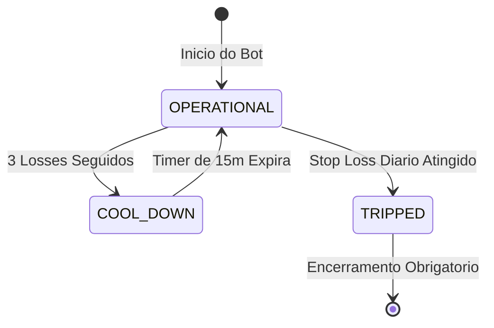
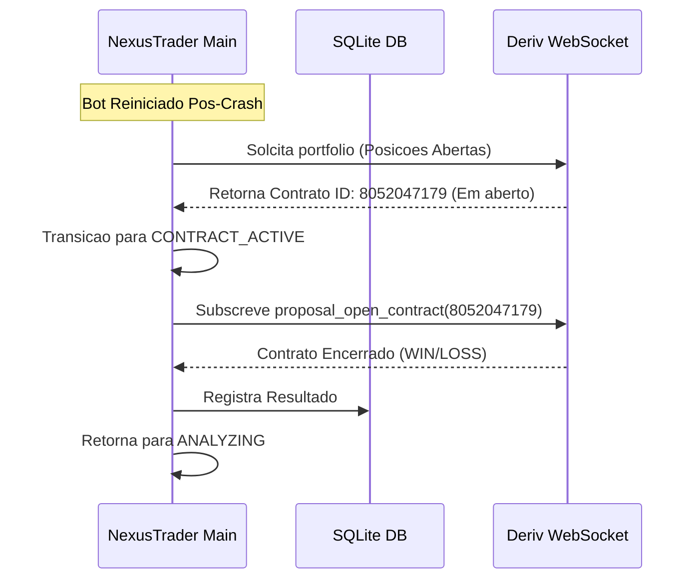

# 🛡️ Especificação Técnica: Fase 3 - Risk Management & Resiliência

Documento oficial de especificação técnica para a **Fase 3** do sistema **NexusTrader**. O objetivo desta fase é blindar o bot contra perdas catastróficas na corretora e garantir alta resiliência operacional (recuperação automática após quedas de rede/processo).

---

## 📅 Visão Geral da Fase 3

- **Objetivo:** Implementar regras rígidas de gestão de risco financeiro (Stop Loss, Take Profit, Circuit Breakers) e resiliência de estado (recuperação pós-crash).
- **Duração Estimada:** 2-3 semanas.
- **Resultado Esperado:** Um sistema que para imediatamente ao atingir os limites financeiros, recusa operações em momentos de instabilidade e consegue recuperar ordens abertas em caso de desconexão.

---

## 🏗️ Módulos a Serem Desenvolvidos

```
nexus-trader/
├── risk/
│   ├── __init__.py
│   ├── risk_manager.py       # Gestor central de limites (Stop Loss, Take Profit, Max Daily Trades)
│   ├── circuit_breaker.py   # Pausa automatica por N losses consecutivos ou volatilidade
│   └── session_manager.py   # Controle de horarios de operacao
├── core/
│   ├── recovery.py          # Modulo de reconstituicao de estado pos-crash
│   └── heartbeat.py         # Monitor de latencia e saude da conexao
└── tests/
    └── test_risk.py         # Suite de testes automatizados de risco
```

---

## 🎛️ Requisito Fundamental: Configuração Dinâmica via Interface/Banco

> [!IMPORTANT]
> **Arquitetura Dinâmica:** As regras de gestão de risco e banca **NÃO** serão estáticas no código. 
> Elas serão salvas no Banco de Dados (`SQLite`/`PostgreSQL`) e estruturadas em JSON. Quando implementarmos a Interface Web (Fase 4), você poderá alterar qualquer parâmetro (Stop Loss, Take Profit, Níveis de Martingale, Valor Inicial) na tela do App, e o **Core Engine lerá e aplicará as novas regras automaticamente em tempo real** sem precisar reiniciar o robô.

---

## 1. Módulo de Risco Financeiro (`risk/risk_manager.py`)

O `RiskManager` atuará como um guardião antes de qualquer sinal de estratégia ser enviado para a corretora.

### 📋 Requisitos de Risco:
1. **Daily Stop Loss (Perda Máxima Diária):** Se o PnL acumulado do dia atingir um valor negativo (ex: -$50.00), o robô encerra todas as operações do dia imediatamente.
2. **Daily Take Profit (Meta de Lucro Diário):** Se o PnL acumulado atingir a meta (ex: +$100.00), o robô encerra o dia com lucro garantido.
3. **Max Daily Trades:** Limite máximo de operações permitidas por dia (ex: 50 trades) para evitar *overtrading*.
4. **Max Stake Limit:** Nenhuma ordem poderá ser enviada com stake superior a um limite seguro pré-configurado (ex: $20.00).

```python
class RiskManager:
    def __init__(
        self,
        stop_loss_daily: float = 50.0,
        take_profit_daily: float = 100.0,
        max_daily_trades: int = 50,
        max_single_stake: float = 20.0
    ):
        self.stop_loss_daily = abs(stop_loss_daily)
        self.take_profit_daily = abs(take_profit_daily)
        self.max_daily_trades = max_daily_trades
        self.max_single_stake = max_single_stake
        
    def can_open_trade(self, current_pnl: float, daily_trades: int, next_stake: float) -> tuple[bool, str]:
        if current_pnl <= -self.stop_loss_daily:
            return False, f"Stop Loss Diario atingido: ${current_pnl:.2f} <= -${self.stop_loss_daily:.2f}"
            
        if current_pnl >= self.take_profit_daily:
            return False, f"Take Profit Diario atingido: ${current_pnl:.2f} >= ${self.take_profit_daily:.2f}"
            
        if daily_trades >= self.max_daily_trades:
            return False, f"Limite diario de trades atingido: {daily_trades}/{self.max_daily_trades}"
            
        if next_stake > self.max_single_stake:
            return False, f"Stake solicitada (${next_stake:.2f}) excede o limite maximo (${self.max_single_stake:.2f})"
            
        return True, "OK"
```

---

## 2. Circuit Breaker (`risk/circuit_breaker.py`)

O `CircuitBreaker` protege a banca em momentos de má fase (*drawdown* acelerado ou sequências de *losses*).

### ⚡ Regras do Circuit Breaker:
- **Max Consecutive Losses:** Se o bot acumular N perdas seguidas (ex: 3 losses), a operação entra em estado de **Cool-down** (pausa de 15 minutos).
- **Auto Reset:** Após os 15 minutos de pausa, o bot faz um teste suave e reseta a contagem de perdas.



---

## 3. Gestão de Sessão (`risk/session_manager.py`)

Permite definir horários específicos em que o bot tem autorização para operar (ex: apenas no horário comercial ou fora de horários de divulgações de notícias de alto impacto).

---

## 4. Preservação de Estado & Recomposição (`core/recovery.py`)

Se o bot for reiniciado (crash de servidor, reboot ou falta de energia) enquanto houver uma ordem em andamento:

1. **Na Inicialização:** O bot consulta as posições abertas na Deriv via `portfolio` ou `proposal_open_contract`.
2. **Re-Vínculo:** Se encontrar um `contract_id` pendente, o bot reconecta o monitoramento sem abrir uma nova ordem.
3. **Sincronização:** Aguarda a finalização da ordem aberta e atualiza o PnL antes de permitir novos sinais da estratégia.



---

## 🧪 Plano de Testes da Fase 3

1. **Teste de Stop Loss Diário:** Simular perdas até atingir a meta de Stop Loss e verificar se o robô recusa novas entradas.
2. **Teste de Take Profit Diário:** Simular lucros até a meta e verificar encerramento seguro.
3. **Teste de Circuit Breaker:** Simular 3 losses seguidos e verificar se o timer de pausa de 15 minutos é acionado.
4. **Teste de Crash Recovery:** Iniciar uma ordem na conta Demo e interromper o processo (`SIGKILL`). Ao religar o bot, ele deve recuperar a ordem em andamento sem duplicar a compra.

---

## ✅ Critérios de Aceitação da Fase 3

- [ ] Nenhuma ordem é enviada se o Stop Loss ou Take Profit diário for atingido.
- [ ] O robô respeita o limite de stake máximo por operação.
- [ ] O robô entra em pausa automaticamente após 3 perdas seguidas.
- [ ] O robô consegue religar e sincronizar uma ordem que já estava aberta na Deriv sem dar erro.
- [ ] Suíte de testes unitários para todos os módulos de risco.
