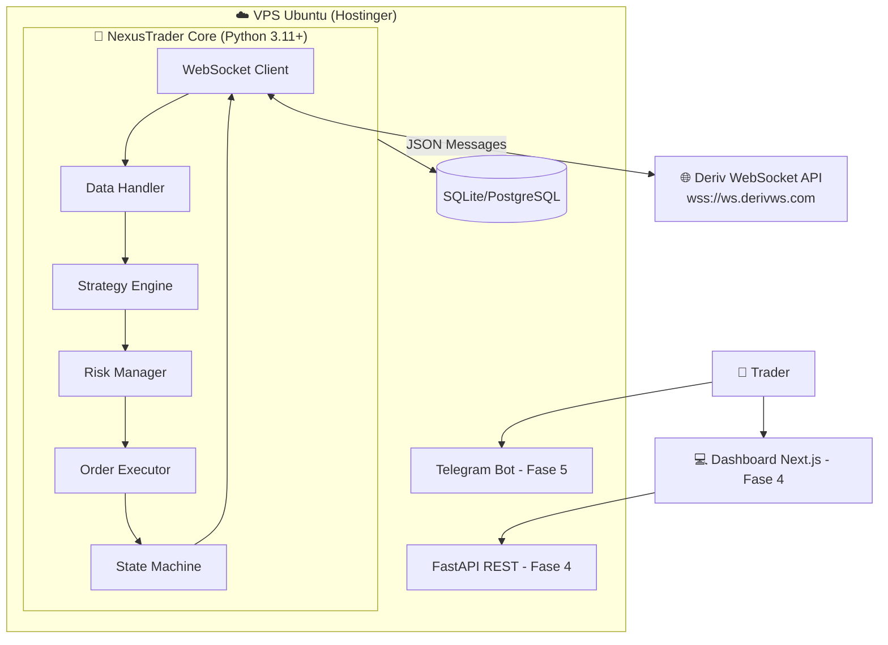

# 🔷 NexusTrader - Hub de Documentação

> **Plataforma de Trading Automatizado para Deriv**
> Versão: 0.1.0 | Status: 📐 Fase 1 - Planejamento

---

## 📁 Documentação do Projeto

| # | Documento | Descrição | Status |
|:--|:----------|:----------|:-------|
| 1 | [ROADMAP.md](./ROADMAP.md) | Roadmap completo com 6 fases, cronograma Gantt, stack e critérios | ✅ Pronto |
| 2 | [PRD.md](./PRD.md) | Product Requirements Document — requisitos funcionais e não-funcionais | ✅ Pronto |
| 3 | [FASE-1-SPEC.md](./FASE-1-SPEC.md) | Especificação técnica detalhada da Fase 1 (Core Engine) | ✅ Pronto |
| 4 | [DERIV-API-REFERENCE.md](./DERIV-API-REFERENCE.md) | Referência técnica completa da Deriv API (WebSocket + REST) | ✅ Pronto |

---

## 🏗️ Arquitetura em Alto Nível



---

## 🎯 Visão Geral das Fases

| Fase | Nome | Duração | Foco |
|:-----|:-----|:--------|:-----|
| **1** | Core Engine & API | 4-5 semanas | Conexão, auth, ciclo de trade completo |
| **2** | Estratégias & Indicadores | 3-4 semanas | BB, RSI, MACD, gestão de banca |
| **3** | Risk Management | 2-3 semanas | Stop loss, circuit breaker, limites |
| **4** | Dashboard Web | 4-5 semanas | FastAPI + Next.js, gráficos, controle |
| **5** | Notificações | 2-3 semanas | Telegram, Discord, relatórios |
| **6** | Multi-conta & Produção | 3-4 semanas | Copy trading, CI/CD, monitoring |

---

## 🛠️ Stack Tecnológico

| Camada | Tecnologia | Versão |
|:-------|:-----------|:-------|
| Linguagem | Python | 3.11+ |
| Runtime | asyncio | stdlib |
| SDK Deriv | python-deriv-api | latest |
| Indicadores | pandas-ta | latest |
| Dados | pandas / numpy | latest |
| API REST | FastAPI | 0.100+ |
| Frontend | Next.js | 14+ |
| Database | SQLite → PostgreSQL | - |
| ORM | SQLAlchemy + aiosqlite | 2.0+ |
| Process Mgmt | systemd | nativo Ubuntu |
| OS | Ubuntu | 22.04 LTS |
| Hosting | Hostinger VPS | - |

---

## 🚀 Quick Start (Fase 1)

```bash
# 1. Clonar o repositório
git clone <repo-url> nexus-trader
cd nexus-trader

# 2. Criar e ativar ambiente virtual
python3.11 -m venv venv
source venv/bin/activate  # Linux
# venv\Scripts\activate   # Windows

# 3. Instalar dependências
pip install -r requirements.txt

# 4. Configurar variáveis de ambiente
cp .env.example .env
# Editar .env com seu APP_ID e API_TOKEN

# 5. Rodar o bot
python main.py
```

---

## 📝 Pré-requisitos para Começar

- [ ] Conta na Deriv (demo ou real)
- [ ] App ID registrado em [developers.deriv.com](https://developers.deriv.com)
- [ ] API Token gerado com escopos **Read** + **Trade**
- [ ] Python 3.11+ instalado
- [ ] VPS Hostinger com Ubuntu 22.04 (para deploy)

---

## 📚 Links Úteis

| Recurso | URL |
|:--------|:----|
| Deriv API Docs | [developers.deriv.com/docs](https://developers.deriv.com/docs/) |
| API Playground | [developers.deriv.com/playground](https://developers.deriv.com/playground/) |
| AI Hub | [developers.deriv.com/ai-hub](https://developers.deriv.com/ai-hub/) |
| Python SDK | [github.com/deriv-com/python-deriv-api](https://github.com/deriv-com/python-deriv-api) |
| DBot (Referência XML) | [bot.deriv.com](https://bot.deriv.com/) |

---

> 📅 **Última atualização**: Agosto 2026
> 🏷️ **Projeto**: NexusTrader v0.1.0
