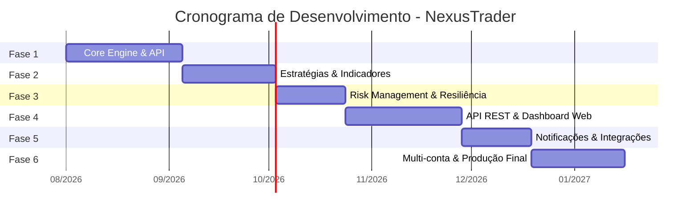
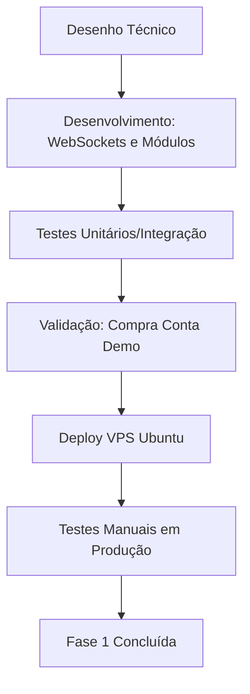
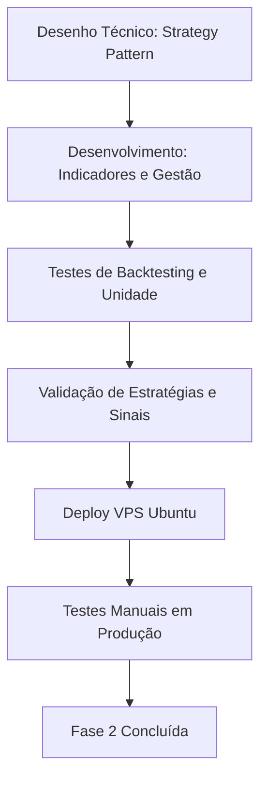
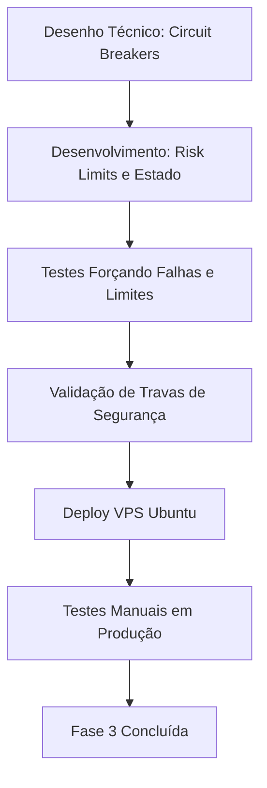
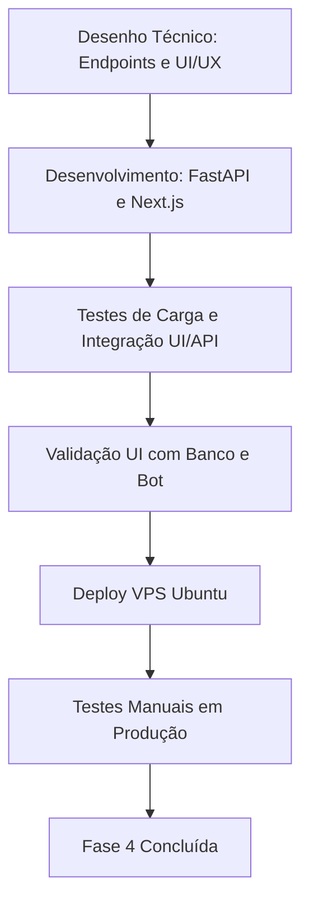
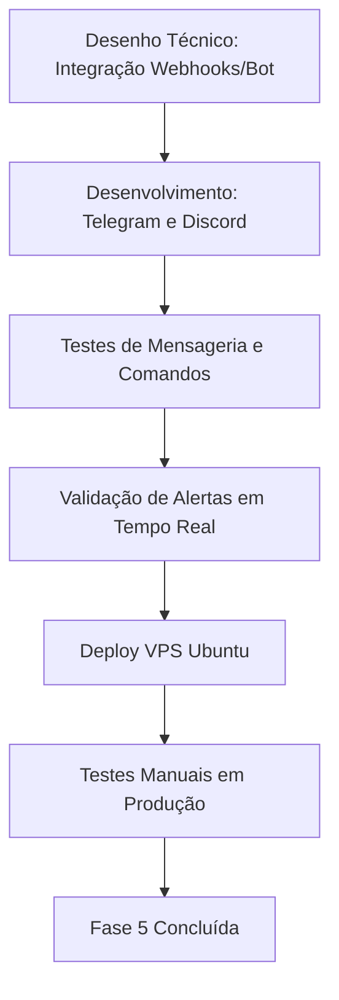
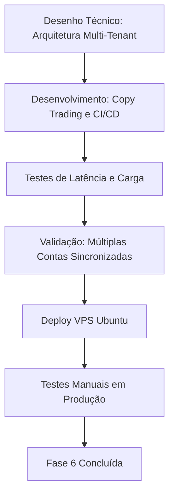

# 🚀 NexusTrader - Roadmap de Desenvolvimento

Bem-vindo ao roadmap oficial do **NexusTrader**, uma aplicação completa de *automated trading* para a plataforma Deriv.

## 📊 Cronograma do Projeto

## 🛠️ Stack Tecnológico

A stack escolhida visa performance, escalabilidade e manutenibilidade.

| Categoria | Tecnologia | Descrição |
| :--- | :--- | :--- |
| **Linguagem Base** | Python 3.11+ | Utilizando *asyncio* para chamadas concorrentes. |
| **Integração API** | python-deriv-api | SDK oficial da Deriv. |
| **Análise de Dados** | pandas + pandas-ta | Manipulação de dados e cálculo de indicadores técnicos. |
| **API Backend (Fase 4)**| FastAPI | Framework moderno e rápido para construção de APIs REST. |
| **Frontend Web (Fase 4)**| Next.js | Framework React para o *Dashboard* web. |
| **Banco de Dados** | SQLite / PostgreSQL | Persistência de dados locais e em nuvem. |
| **Processamento** | systemd | Gerenciamento de processos do bot (Daemon). |
| **Infraestrutura** | Ubuntu 22.04 LTS | Sistema operacional do VPS (Hostinger). |

---

> [!NOTE]
> **Ciclo de Entrega (Aplicável a todas as fases):**
> Desenho Técnico ➔ Desenvolvimento ➔ Testes ➔ Validação ➔ Deploy em VPS (Ubuntu - Hostinger) ➔ Testes Manuais Reais em Produção ➔ Fase Concluída.

---

## 🎯 Fases do Projeto

### Fase 1: Core Engine & Conexão com a API 
**Objetivo:** Estabelecer a base do sistema com conexão WebSocket estável à Deriv API, autenticação, e capacidade de executar o ciclo completo de *trading* (*proposal* → *buy* → *monitor* → *result*).

- ⏱️ **Duração Estimada:** 4-5 semanas

#### 📦 Entregas
* Estrutura de projeto Python com arquitetura modular
* Módulo de conexão WebSocket com reconexão automática
* Módulo de autenticação (*authorize* com API token)
* Módulo de dados de mercado (*ticks*, *ticks_history*, *candles*)
* Módulo de execução de ordens (*proposal*, *buy*, *sell*)
* Módulo de monitoramento de contratos (*proposal_open_contract*)
* Sistema de *logging* estruturado
* Configuração via `.env`
* Testes unitários e de integração básicos
* *Deploy* inicial no VPS com `systemd`
* Teste de ciclo completo em conta *demo*

#### ✅ Critérios de Aceitação
* Conexão com a API Deriv estável por 24h sem crash.
* Reconexão automática em caso de queda da rede.
* Bot capaz de comprar um contrato em conta *demo* e processar o resultado com sucesso.
* *Logs* detalhados de todas as ações no VPS.

#### 🔗 Dependências
* Conta na Deriv.
* API Tokens (Leitura e Execução).
* VPS Ubuntu configurado.

#### ⚠️ Riscos
* Instabilidades ou rate limits da Deriv API.
* Desconexões inesperadas do WebSocket.

#### 🔄 Fluxo da Fase 1

---

### Fase 2: Estratégias de Trading & Indicadores Técnicos
**Objetivo:** Implementar o motor de estratégias com indicadores técnicos e sistema de sinais.

- ⏱️ **Duração Estimada:** 3-4 semanas

#### 📦 Entregas
* Motor de estratégias *plugável* (Strategy Pattern)
* Indicadores técnicos via `pandas-ta` (BB, RSI, SMA, EMA, MACD)
* Estratégia de *Bollinger Bands* (replicando o robô XML existente)
* Estratégia de RSI
* Sistema de gestão de banca (Soros, Martingale, Mão Fixa, D'Alembert)
* *Backtesting engine* com dados históricos
* Dashboard de *performance* em terminal (`rich`/`textual`)

#### ✅ Critérios de Aceitação
* Indicadores técnicos batem com os valores da plataforma Deriv.
* Bot executa estratégias baseadas em sinais automaticamente.
* Gestão de banca calcula *stakes* corretamente após perdas/ganhos.
* Dashboard no terminal exibe PL (Profit/Loss) corretamente.

#### 🔗 Dependências
* Fase 1 concluída (Core Engine funcional).
* Histórico de ticks válido.

#### ⚠️ Riscos
* Latência no cálculo de indicadores atrasando a entrada nas operações.
* Divergências de preço nos *candles* calculados localmente.

#### 🔄 Fluxo da Fase 2

---

### Fase 3: Risk Management & Resiliência
**Objetivo:** Blindar o sistema contra perdas catastróficas e falhas operacionais.

- ⏱️ **Duração Estimada:** 2-3 semanas

#### 📦 Entregas
* *Stop Loss* / *Take Profit* globais e por estratégia
* Limite diário de operações e de perda monetária máxima
* *Circuit breaker* (pausa automática após N *losses* seguidos)
* Gestão de sessão (horários definidos de operação)
* *Healthcheck* e *heartbeat*
* Reconexão inteligente com preservação de estado
* Alertas críticos via *webhook*

#### ✅ Critérios de Aceitação
* Bot para imediatamente ao atingir o limite de perda (Daily Stop).
* Bot pausa as operações fora do horário configurado.
* Recuperação de estado de operação aberta após uma queda de energia ou *restart* do serviço.
* *Circuit breaker* funcional após N perdas.

#### 🔗 Dependências
* Módulos de estratégia e execução rodando (Fase 1 e 2).

#### ⚠️ Riscos
* Bot não conseguir identificar que um contrato estava aberto antes de um crash.
* Erros lógicos causando ignorância de regras de risco (Stop Loss não acionado).

#### 🔄 Fluxo da Fase 3

---

### Fase 4: API REST & Dashboard Web
**Objetivo:** Criar interface *web* amigável para controle e monitoramento do sistema em tempo real.

- ⏱️ **Duração Estimada:** 4-5 semanas

#### 📦 Entregas
* API REST (FastAPI) para controlar o *bot*
* *Dashboard* web com Next.js
* Autenticação via JWT
* Painel de controle: comandos *start*, *stop*, e status dos bots
* Gráficos de *performance* em tempo real
* Histórico detalhado de operações
* Configuração de estratégias e parâmetros de risco diretamente via UI

#### ✅ Critérios de Aceitação
* API FastAPI responde em menos de 100ms.
* Interface *web* protegida por login seguro (JWT).
* Capacidade de parar o *bot* pelo navegador imediatamente.
* Gráficos refletindo PnL (Profit and Loss) precisos.

#### 🔗 Dependências
* Banco de dados configurado (PostgreSQL/SQLite) para histórico.
* Core engine precisa ser adaptado para aceitar comandos via API.

#### ⚠️ Riscos
* Problemas de concorrência (*Race conditions*) entre a API REST e o motor *asyncio* do trading.
* Segurança do painel web exposto publicamente.

#### 🔄 Fluxo da Fase 4

---

### Fase 5: Notificações & Integrações
**Objetivo:** Integrar com plataformas de comunicação para garantir que os operadores sejam informados sem precisar olhar o painel constantemente.

- ⏱️ **Duração Estimada:** 2-3 semanas

#### 📦 Entregas
* *Bot* do Telegram para receber notificações push e enviar comandos básicos
* *Webhooks* de notificação para canais no Discord
* Geração de relatórios diários automáticos de *performance*
* Alertas de risco (*Drawdown*, Limites atingidos) enviados em tempo real

#### ✅ Critérios de Aceitação
* Relatório diário de fechamento de caixa enviado para o Telegram/Discord.
* Notificação push imediata quando um *Stop Loss* global for acionado.
* Controle remoto básico do *bot* via Telegram (Start/Stop).

#### 🔗 Dependências
* Tokens do Telegram Bot API.
* URLs de Webhook do Discord.
* API REST e motor de *trading* funcionais.

#### ⚠️ Riscos
* *Rate limits* e bloqueios da API do Telegram por envio excessivo de mensagens (ex: notificar todo *tick*).

#### 🔄 Fluxo da Fase 5

---

### Fase 6: Multi-conta, Otimização & Produção Final
**Objetivo:** Preparar a aplicação para operação robusta em escala e em múltiplas contas simultaneamente.

- ⏱️ **Duração Estimada:** 3-4 semanas

#### 📦 Entregas
* Suporte arquitetural a múltiplas contas simultâneas rodando no mesmo sistema
* Funcionalidade de *Copy trading* entre uma conta "Mestre" e contas "Escravas"
* Otimização de parâmetros via *grid search* (machine learning / algoritmos genéticos básicos)
* Monitoramento avançado da infraestrutura utilizando Grafana e Prometheus
* Documentação completa de operação e manual do usuário
* *Pipeline* de CI/CD (GitHub Actions / GitLab CI)

#### ✅ Critérios de Aceitação
* Uma ordem na conta Mestre deve ser replicada nas contas escravas com latência < 200ms.
* Grafana mostrando consumo de CPU, RAM e número de conexões WebSocket.
* Novos *commits* na *branch* `main` fazem *deploy* automático no VPS sem *downtime* notável.

#### 🔗 Dependências
* Toda a infraestrutura das Fases 1 a 5 estável.
* Acesso *root* e configuração Docker/Systemd avançada no Ubuntu.

#### ⚠️ Riscos
* Alto consumo de memória e CPU por instanciar múltiplos clientes WebSockets pesados.
* Contas sendo banidas por operações de *copy trading* não otimizadas (problemas com a corretora).

#### 🔄 Fluxo da Fase 6

---
> Elaborado para o desenvolvimento profissional e sistemático do **NexusTrader**. 🚀
